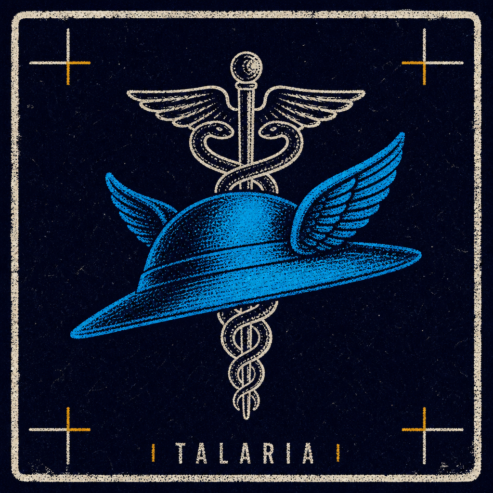

[Português](README.pt-BR.md)

<p align="center">
  
</p>

# Talaria ☤


Playwright stealth evasion skill for agents. The messenger crosses the gate; the browser crosses the WAF. **Not a CAPTCHA solver.**

Only automate sites you are authorized to access.

## What it does

- Launches Playwright via `playwright-extra` + `puppeteer-extra-plugin-stealth`
- Hides automation leaks (`navigator.webdriver`, `HeadlessChrome` UA, empty plugins)
- Reduces the chance a basic WAF triggers a challenge from fingerprint alone
- Exposes `launchStealthBrowser()` (API) and `scripts/cli.js` (visit / screenshot / HTML / JSON)
- Optional proxy via `.env`

## What it does NOT do

- Does not solve visible CAPTCHAs (reCAPTCHA, hCaptcha, Turnstile)
- Does not replace a residential proxy when the IP is burned
- Does not guarantee bypass of Cloudflare / DataDome / PerimeterX-class stacks
- Does not integrate paid solvers (2Captcha, Bright Data Web Unlocker, etc.)

## Install

The skill lives in [`skills/talaria/`](skills/talaria/). Compatible with Cursor, Codex, Hermes, OpenClaw, and [agentskills.io](https://agentskills.io).

### OpenClaw / ClawHub

```bash
openclaw skills search talaria
openclaw skills install @gadielkalleb/talaria

# or install from GitHub
openclaw skills install github:gadielkalleb/talaria/skills/talaria
```

Publish updates (maintainers):

```bash
cd skills/talaria
clawhub login
clawhub skill publish . \
  --slug talaria \
  --name "Talaria" \
  --categories automation,research \
  --topics "playwright,stealth,browser,waf"
```

### Hermes Agent

```bash
# ClawHub (after publish)
hermes skills search talaria --source clawhub
hermes skills install clawhub/talaria

# GitHub tap
hermes skills tap add gadielkalleb/talaria
hermes skills install gadielkalleb/talaria/talaria

# Direct install (full repo path)
hermes skills install gadielkalleb/talaria/skills/talaria
```

### skills.sh / npx skills

```bash
npx skills add gadielkalleb/talaria --skill talaria
npx skills add gadielkalleb/talaria --skill talaria --agent hermes
```

### Local copy (Hermes / Cursor / Codex)

```bash
bash install.sh ~/.hermes/skills/talaria
bash install.sh ~/.cursor/skills/talaria
bash install.sh ~/.codex/skills/talaria
```

Then, in the skill directory:

```bash
cd skills/talaria && npm run setup
```

Optional proxy: copy `skills/talaria/.env.example` to `.env`.

Agents resolve `$SKILL_DIR` as the folder that contains [`SKILL.md`](skills/talaria/SKILL.md) and run from there.

## CLI

```bash
node skills/talaria/scripts/cli.js --url https://example.com --screenshot out.png --html out.html --json
```

| Flag | Role |
| --- | --- |
| `--url` | required |
| `--screenshot` | full-page PNG |
| `--html` | page HTML |
| `--wait-selector` | wait for a CSS selector |
| `--timeout` | ms (default 30000) |
| `--headed` | visible browser |
| `--proxy` | `http://host:port` |
| `--json` | result on stdout |

## API

```js
import { launchStealthBrowser } from './scripts/index.js'

const { browser, page } = await launchStealthBrowser({
  headless: true,
  proxy: process.env.PROXY_SERVER,
})

await page.goto(url, { waitUntil: 'domcontentloaded' })
await browser.close()
```

Options: `headless`, `slowMo`, `proxy`, `userAgent`, `viewport`, `locale`, `args`.

Headless uses full Chromium (`channel: 'chromium'`), not Playwright 1.49+ `chrome-headless-shell` — Stealth does not cover the shell well.

## Tests

```bash
cd skills/talaria && npm test
```

- stealth signals on `about:blank` vs vanilla Playwright
- WebDriver/Chrome checks on `https://bot.sannysoft.com/` (needs network)
- CLI (`--json`, HTML, PNG)

sannysoft is a 2018 fingerprint page. Passing it is necessary, not sufficient, for 2026 WAFs.

## Limits

If a challenge is still on the page: report it. Do not invent a solver. Residential proxy / clean IP is the next step.

## Acknowledgments

The stealth stack (`playwright-extra` + `puppeteer-extra-plugin-stealth`) follows the approach in [How to Bypass CAPTCHAs With Playwright](https://brightdata.com.br/blog/dados-do-site/bypass-captchas-with-playwright) by [Antonello Zanini](https://brightdata.com/blog/authors/antonello-zanini) (Bright Data). Talaria wraps that pattern into a portable agent skill; it is not affiliated with Bright Data.

## License

MIT
