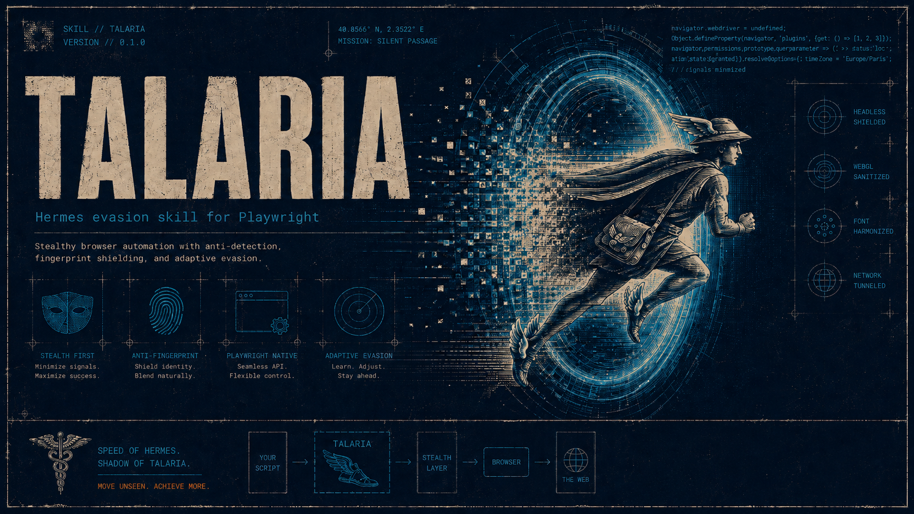

[English](README.md)

# Talaria ☤



Skill de evasão Playwright para agentes. O mensageiro atravessa o portal; o browser atravessa o WAF. **Não é um solver de CAPTCHA.**

Só automatize websites aos quais você autorizou acesso.

## O que faz

- Lança Playwright via `playwright-extra` + `puppeteer-extra-plugin-stealth`
- Esconde leaks de automação (`navigator.webdriver`, UA `HeadlessChrome`, plugins vazios)
- Reduz a chance de um WAF básico disparar desafio só por fingerprint
- Expõe `launchStealthBrowser()` (API) e `scripts/cli.js` (visit / screenshot / HTML / JSON)
- Proxy opcional via `.env`

## O que não faz

- Não resolve CAPTCHA visível (reCAPTCHA, hCaptcha, Turnstile)
- Não substitui proxy residencial quando o IP está queimado
- Não garante bypass de Cloudflare / DataDome / PerimeterX avançados
- Não integra solvers pagos (2Captcha, Bright Data Web Unlocker, etc.)

## Instalar

A skill fica em [`skills/talaria/`](skills/talaria/). Compatível com Cursor, Codex, Hermes, OpenClaw e [agentskills.io](https://agentskills.io).

### OpenClaw / ClawHub

**ClawHub:** [clawhub.ai/gadielkalleb/talaria](https://clawhub.ai/gadielkalleb/talaria)

```bash
# ClawHub CLI
npx clawhub install talaria

# OpenClaw
openclaw skills install @gadielkalleb/talaria

# ou instalar do GitHub
openclaw skills install github:gadielkalleb/talaria/skills/talaria
```

Depois de instalar, na pasta da skill:

```bash
npm run setup
node scripts/cli.js --url https://example.com --json
```

Publicar atualizações (maintainers):

```bash
cd skills/talaria
clawhub login
clawhub skill publish . \
  --slug talaria \
  --name "Talaria" \
  --categories automation,research \
  --topics "playwright,stealth,browser,waf"
```

### Hermes Agent

```bash
# ClawHub (instalar pelo slug — a busca ainda pode não listar)
hermes skills install clawhub/talaria -y

# Tap GitHub
hermes skills tap add gadielkalleb/talaria
hermes skills install gadielkalleb/talaria/talaria

# Instalação direta (path completo no repo)
hermes skills install gadielkalleb/talaria/skills/talaria
```

Depois: `cd ~/.hermes/skills/talaria && npm run setup`

### skills.sh / npx skills

```bash
npx skills add gadielkalleb/talaria --skill talaria
npx skills add gadielkalleb/talaria --skill talaria --agent hermes
```

### Cópia local (Hermes / Cursor / Codex)

```bash
bash install.sh ~/.hermes/skills/talaria
bash install.sh ~/.cursor/skills/talaria
bash install.sh ~/.codex/skills/talaria
```

Depois, na pasta da skill:

```bash
cd skills/talaria && npm run setup
```

Proxy opcional: copie `skills/talaria/env.example` para `.env` e exporte as vars (ou use `--proxy`).

Agentes resolvem `$SKILL_DIR` como a pasta que contém [`SKILL.md`](skills/talaria/SKILL.md) e executam a partir dela.

## CLI

```bash
node skills/talaria/scripts/cli.js --url https://example.com --screenshot out.png --html out.html --json
```

| Flag | Função |
| --- | --- |
| `--url` | obrigatória |
| `--screenshot` | PNG full page |
| `--html` | HTML da página |
| `--wait-selector` | espera um CSS selector |
| `--timeout` | ms (padrão 30000) |
| `--headed` | browser visível |
| `--proxy` | `http://host:port` |
| `--json` | resultado no stdout |

## API

```js
import { launchStealthBrowser } from './scripts/index.js'

const { browser, page } = await launchStealthBrowser({
  headless: true,
  proxy: process.env.PROXY_SERVER,
})

await page.goto(url, { waitUntil: 'domcontentloaded' })
await browser.close()
```

Opções: `headless`, `slowMo`, `proxy`, `userAgent`, `viewport`, `locale`, `args`.

No headless usa Chromium completo (`channel: 'chromium'`), não o `chrome-headless-shell` do Playwright 1.49+ — o Stealth não cobre bem o shell.

## Testes

Em um clone completo do git (instalações via hub não incluem `test/`):

```bash
cd skills/talaria && npm test
```

Após instalar pelo ClawHub/Hermes, use smoke-check: `node scripts/cli.js --url https://example.com --json`.

- sinais stealth em `about:blank` vs Playwright cru
- checks WebDriver/Chrome em `https://bot.sannysoft.com/` (precisa de internet)
- CLI (`--json`, HTML, PNG)

sannysoft é uma página de fingerprint de 2018. Passar nela é necessário, não suficiente, para WAFs de 2026.

## Limites

Se o desafio continuar na página: relate. Não invente solver. O próximo passo é proxy residencial / IP limpo.

## Créditos

A stack stealth (`playwright-extra` + `puppeteer-extra-plugin-stealth`) segue a abordagem do artigo [Como contornar CAPTCHAs com o Playwright](https://brightdata.com.br/blog/dados-do-site/bypass-captchas-with-playwright), de [Antonello Zanini](https://brightdata.com/blog/authors/antonello-zanini) (Bright Data). Talaria empacota esse padrão numa skill portátil para agentes; não é afiliada à Bright Data.

## Licença

MIT
